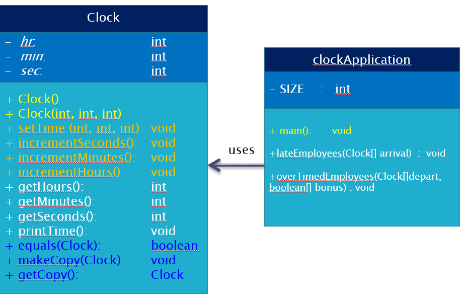

# hw-week4-day2-OOP

---


Let's Implement the famous Clock Class.

In **src** ----> **com.ga** the classes are created and structured you will complete Clock Class code where you find the comment:

```java
// your code goes here 
```
However you can modify clockApplication for your own testing purposes.

---
### A UML Diagram that will help you understand the structure: 




